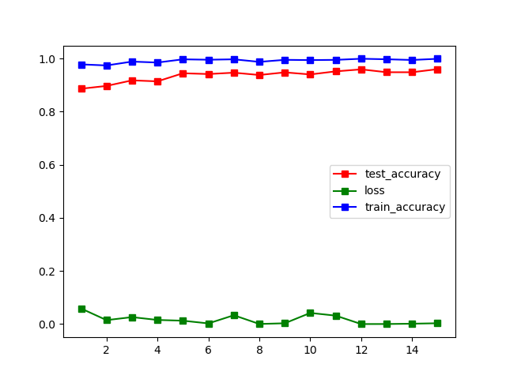
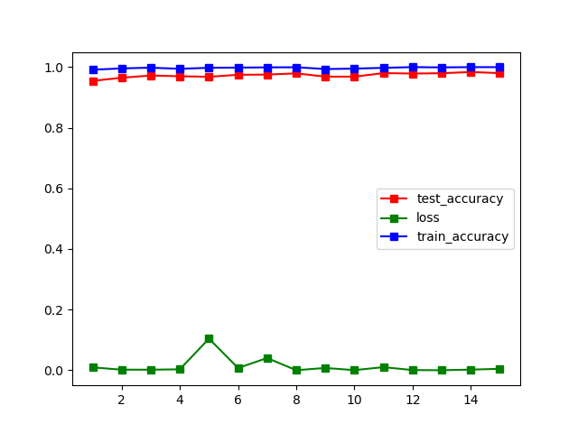

# NUS_CV_G7

**张柯远、徐承启、庄宇凡、李佳霖**

**SuSTech**

**2021 from July 12 to July 28**

### TimeTable

| Time | Achievement | Remarks |
| :----------- | ---------- | ---------- |
| 7.16      | Beginner level complete  ||
| 7.18      | Expert level complete  | simply add pre-processing method，Bonus CNN still has problem |
| 7.19      | new plan  | Bonus CNN complete，Bonus try no CNN method，try object detection |
| 7.20      | finish data agumentation  | different in CNN and traditional method |

### Beginner level

[beginner.ipynb](https://github.com/LIKP0/NUS_CV_G7/blob/main/src/beginner.ipynb)

### Expert level

[Expert_differentPreprocessing.ipynb](https://github.com/LIKP0/NUS_CV_G7/blob/main/src/Expert_differentPreprocessing.ipynb)

[Expert_differentClassifier.ipynb](https://github.com/LIKP0/NUS_CV_G7/blob/main/src/Expert_differentClassifier.ipynb)

- Pre-processing image

| Method | Result |
| ----------- | ---------- |
| resize to 48\*48     | 0.943  |
| Resample to make samples distribute uniformly   | 0.972  |
| Histogram Equalization   |0.935   |
| Resample + Histogram Equalization  |0.962  |
| add data augumentation (plan to do)   |   |
| data strengthen by library (not plan to do temporarily)   |   |

- Extract features

| Method | Result |
| ----------- | ---------- |
| HOG     | 0.943  |
|    SIFT   |  |

- Classify model

**All defalut core and parameters**

| Method | Result |
| ----------- | ---------- |
| svm.SVC()     | 0.944  |
|    RandomForestClassifier()   | 0.975 |
|  GaussianNB()  | 0.781 |
|  KNeighborsClassifier(k= 1,3,5,7,9)  | max 0.968 |

### Bonus Level

[CNN.py](https://github.com/LIKP0/NUS_CV_G7/blob/main/src/CNN.py)

#### Attempt 1
##### Preprocess: 
- Histogram Equalization
- Resize to 32*32

##### Classifier: 
Hierarchical CNN + 1 linear layer
##### Result: 
Max accuracy on test set: 95.91%

#### Attempt 2
##### Preprocess: 
- Histogram Equalization
- Crop the picture according to Roi
- Resize to 32*32

##### Classifier: 
Hierarchical CNN + 1 linear layer
##### Result: 
Max accuracy on test set: 98.37%

