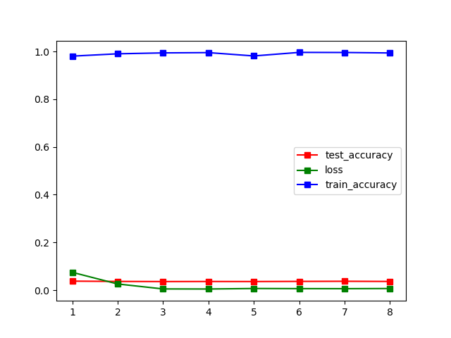

# NUS_CV_G7

**张柯远、徐承启、庄宇凡、李佳霖**

**SuSTech**

**from July 12 to July 28**

### TimeTable

| Time | Achievement | Remarks |
| :----------- | ---------- | ---------- |
| 7.16      | Beginner level complete  ||
| 7.18      | Expert level complete  | 简单添加了预处理和特征提取方法，Bonus部分CNN初步完成仍然存在问题 |
| 7.19      | new plan  | Bonus部分尝试传统方法，尝试目标检测算法 |

### Beginner level

[beginner.ipynb](https://github.com/LIKP0/NUS_CV_G7/blob/main/src/beginner.ipynb)

### Expert level

#### Pre-processing image

| Source | Method | Result |
| -----------| ----------- | ---------- |
| Stater code | resize to 48\*48     | 0.943  |
| | 对数据重采样，使样本分布均匀   |   |
| | 对图像做直方图均衡化   |   |
| | 数据增强（暂时不做）   |   |

#### Extract features

| Source | Method | Result |
| -----------| ----------- | ---------- |
| Stater code | HOG     | 0.943  |
| |    SIFT   |  |
| |  多尺度特征提取（暂时不做）  |  |

#### Classify model

### Bonus Level
#### Attempt 1
##### Preprocess: 
- Histogram Equalization
- Resize to 32*32

##### Classifier: 
CNN + 1 linear layer
##### Result: 

