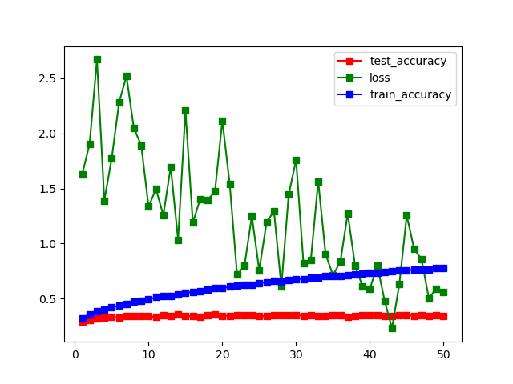

# NUS_CV_G7

**张柯远、徐承启、庄宇凡、李佳霖**

**SuSTech**

**2021 from July 12 to July 28**

## TimeTable

| Time | Achievement | Remarks |
| ----------- | ---------- | ---------- |
| 7.16      | Beginner level complete  ||
| 7.18      | Expert level complete  | simply add pre-processing method，Bonus CNN still has problem |
| 7.19      | new plan  | Bonus CNN complete，Bonus try no CNN method，try object detection in big scale |
| 7.20      | finish data agumentation  | different in CNN and traditional method |

## Beginner level

[beginner.ipynb](https://github.com/LIKP0/NUS_CV_G7/blob/main/src/beginner.ipynb)

## Expert level

[Expert_differentPreprocessing.ipynb](https://github.com/LIKP0/NUS_CV_G7/blob/main/src/Expert_differentPreprocessing.ipynb)

[Expert_differentClassifier.ipynb](https://github.com/LIKP0/NUS_CV_G7/blob/main/src/Expert_differentClassifier.ipynb)

[Expert_augmentation.ipynb](https://github.com/LIKP0/NUS_CV_G7/blob/main/src/Expert_augmentation.ipynb)

- Pre-processing image

| Method | Result |
| ----------- | ---------- |
| resize to 48\*48     | 0.943  |
| Resample to make samples distribute uniformly   | 0.972  |
| Resample to make samples distribute uniformly (dataset2)  | 0.919  |
| Histogram Equalization   |0.935   |
| Resample + Histogram Equalization  |0.962  |
| add data augumentation (plan to do)   |   |
| data strengthen by library (not plan to do temporarily)   |   |

- Method of data agumentation

**Traditional (based on SVM)**

| Method | Remarks | Result |
| ----------- | ---------- | ---------- |
| rotate     | rotate +-10 degree,+-15 degree, each 5% of total data |0.889 |
| multiscale   |    | |
| noise | add Gaussian White noise to 20% of the images|0.901 |
| affine  |  do affine transform to 20% of the images |0.895 |
| fliplr  |    | |
| random crop  | randomly crop 20% of the images  | 0.885|
| mine hard negs   | collect failed test examples for retraining  | |
| counter example   | not collected yet  | |
| More train and test data   | not collected yet  | |

**For CNN**

Use dataloader in pytorch

| Method | Remarks | Result |
| ----------- | ---------- | ---------- |
| mine hard negs   | collect failed test examples for retrain  | |
| counter example   | not collected yet  | |
| More train and test data   | not collected yet  | |

- Extract features

| Method | Result |
| ----------- | ---------- |
| HOG     | 0.943  |
|    SIFT   |  |

- Classify model

| Method | Result |
| ----------- | ---------- |
| svm.SVC()     | 0.944  |
|    RandomForestClassifier()   | 0.975 |
|  GaussianNB()  | 0.781 |
|  KNeighborsClassifier(k= 1,3,5,7,9)  | max 0.968 |

## Bonus Level

[CNN.py](https://github.com/LIKP0/NUS_CV_G7/blob/main/src/CNN.py)

### Attempt 1
#### Preprocess: 
- Histogram Equalization
- Resize to 32*32

#### Classifier: 
Hierarchical CNN + 1 linear layer
#### Result: Max accuracy on test set 95.91%

### Attempt 2
#### Preprocess: 
- Histogram Equalization
- Crop the picture according to Roi
- Resize to 32*32

#### Classifier: 
Hierarchical CNN + 1 linear layer
#### Result: Max accuracy on test set 98.37%

### Attempt 3
#### Preprocess: 
- Histogram Equalization
- Random Affine transform (degree=15)
- Random Brightness change (70% - 130%)
- Random guassian blur
- Crop the picture according to Roi
- Resize to 32*32

#### Classifier: 
Hierarchical CNN + 1 linear layer
#### Result: Max accuracy on test set 37.28%, training set: 77.87%

## Extra work

### Detection in a large scale

Example of error in detection of pictures of large scale

| Method | Remarks | Result |
| ----------- | ---------- | ---------- |
| sliding window 48\*48 + max prob sort   | directly give answers of all patches | very slow and not accurate |
| Object detection algorithm     | to crop the sign first  |  |

#### sliding window 48\*48 + max prob sort

Use model clf trained in expert level (no negative samples)

1. Use sliding window to catch a patch
2. Use **clf.predict_proba(feature)** to get the probality of all categories and get the max
3. if max > max_threshold, collect the patch location
4. sort all the patch locations and show the top ones

[SlidingWindow_v1.ipynb](https://github.com/LIKP0/NUS_CV_G7/blob/main/src/SlidingWindow_v1.ipynb)

#### Object detection algorithm 

1. Train a binary classification model with negative samples, to predict sign or not sign
2. Use sliding window and first detect if it is a sign
3. If it is a sign, use multi-classifier

