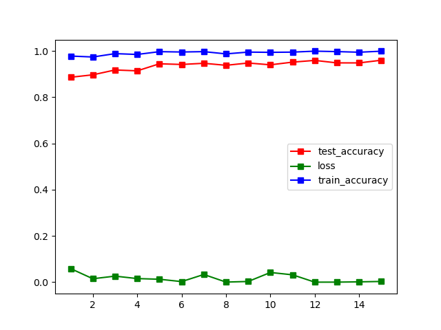
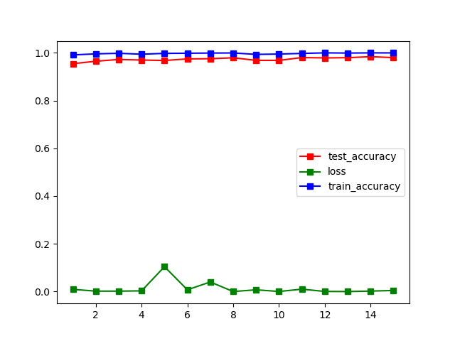

# CNN develop history

## Attempts

### Attempt 1
#### Preprocess: 
- Histogram Equalization
- Resize to 32*32

#### Classifier: 
Hierarchical CNN + 1 linear layer
#### Result: Max accuracy on test set 95.91%

### Attempt 2
#### Preprocess: 
- Histogram Equalization
- Crop the picture according to Roi
- Resize to 32*32

#### Classifier: 
Hierarchical CNN + 1 linear layer
#### Result: Max accuracy on test set 98.37%

### Attempt 3
#### Preprocess: 
- Histogram Equalization
- Crop the picture according to Roi
- Resize to 32*32
- Random Gaussian Blur with kernel (3,3)
- Random Affine transformation(degree=15)
- Random Brightness change(70%-130%)

#### Classifier: 
Hierarchical CNN + 1 linear layer
#### Result: Max accuracy on test set 97.69%

### Attempt 4
#### Preprocess: 
- Histogram Equalization
- Crop the picture according to Roi
- Resize to 32*32
- Random Gaussian Blur with kernel (3,3)
- Random Affine transformation(degree=15)
- Random Brightness change(70%-130%)

#### Classifier: 
Hierarchical CNN + 1 linear layer, reduce 4 convolution layers
#### Result: Max accuracy on test set 97.40%

## Conclusion
For attempt 1 and 2, we just try to get a good result in the test set. However, after that, we found out that the generalization ability of our model is not satisfiing by finding some pictures from the internet and do the test. The test result is not as accurate as it performs in the test set. So, we try to do some data augmentation. We do the gaussian blur to adjust some extreme weather condition such as heavy rain or fog. We do the affine transformation to adjust the different angle of the sign. We do the brightness adjustment to adjust sunshine and night. 

Then, we found out that the model is too heavy. So, we reduce the layer in the nerual network. The parameter number is 9248043 and the reduced model only has 3050283 parameters. The result is good because we just scarifice a little accuracy (and I believe the accuracy can be made up by training more epoch) and the number of parameters decrease to 1/3 of the original model. 
